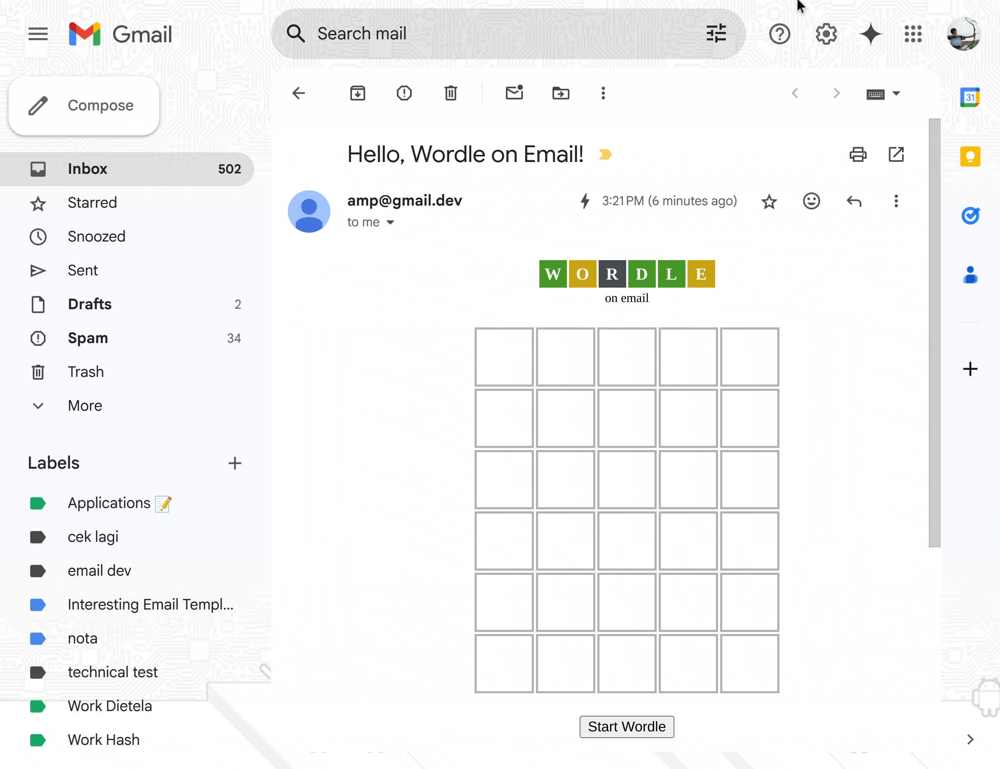

# 📬🎮 Wordle on Email

[badge-workflow]: https://img.shields.io/github/actions/workflow/status/oxwazz/wordle_on_email/release.yml

[link-workflow]: https://github.com/oxwazz/wordle_on_email/actions/workflows/release.yml

[badge-twitter]: https://img.shields.io/twitter/follow/oxwazz

[link-twitter]: https://x.com/oxwazz

[![badge-workflow]][link-workflow]
[![badge-twitter]][link-twitter]

🎮 Wordle on Email is an interactive email-based version of the popular Wordle game. By leveraging [AMP for Email](https://amp.dev/about/email), we enable users to play Wordle directly within their email clients without needing to open an external website.

### Contents

- [Usage](#usage)
- [Why](#why)
- [Limitation](#limitation)
- [Credit](#credit)
- [License](#license)

## Usage

📬 You can try it out in your email inbox following the steps below:

1. Navigate to `Gmail Settings > General > Dynamic email` and `click Developer settings`. This opens a dialog where you can whitelist an email address that can send you dynamic emails for testing purposes.
1. Copy [index.html](./index.html) content and paste to [Gmail’s AMP for Email Playground](https://amp.gmail.dev/playground/). Send.
1. Check your Gmail Inbox. Done.

[source](https://developers.google.com/gmail/ampemail/testing-dynamic-email)

## Why

🖌️ Exploring [AMP for Email](https://amp.dev/about/email) opens up new possibilities for interactive and dynamic content within emails. Without AMP, emails remain static and outdated, much like coding in the 90s. By leveraging AMP, we can bring modern web-like experiences to the inbox, enhancing user engagement and functionality.

## Limitation

📐 The only limitation is from AMP itself, you can [read more](https://developers.google.com/gmail/ampemail/tips) about it, and also you can see the detail of [WG amp for email](https://github.com/ampproject/amphtml/tree/main/docs/spec/email).

## Credit

Made with ❤️ by oxwazz

## License

[MIT](./LICENSE) License © 2025 [Muhammad Rahmahalim](https://github.com/oxwazz)
